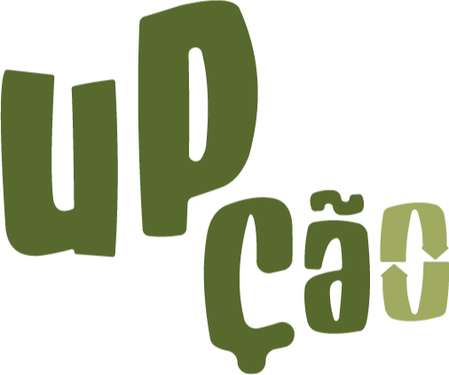

<div id="top"></div>
<!--
*** Thanks for checking out the upcao. If you have a suggestion
*** that would make this better, please fork the repo and create a pull request
*** or simply open an issue with the tag "enhancement".
*** Don't forget to give the project a star!
*** Thanks again! Now go create something AMAZING! :D
-->

<!-- PROJECT SHIELDS -->
<!--
*** I'm using markdown "reference style" links for readability.
*** Reference links are enclosed in brackets [ ] instead of parentheses ( ).
*** See the bottom of this document for the declaration of the reference variables
*** for contributors-url, forks-url, etc. This is an optional, concise syntax you may use.
*** https://www.markdownguide.org/basic-syntax/#reference-style-links
-->

[![Contributors][contributors-shield]][contributors-url]
[![Forks][forks-shield]][forks-url]
[![Stargazers][stars-shield]][stars-url]
[![Issues][issues-shield]][issues-url]

<!-- PROJECT LOGO -->
<br />
<div align="center">
  <a href="https://github.com/brenno-calado/upcao">
    
  </a>

  <h3 align="center">Upção</h3>

  <p align="center">
    <br />
    <a href="https://github.com/brenno-calado/upcao"><strong>Explore a documentação »</strong></a>
    <br />
    <br />
    <a href="https://github.com/brenno-calado/upcao">Demo</a>
    ·
    <a href="https://github.com/brenno-calado/upcao/issues">Reportar Bug</a>
    ·
    <a href="https://github.com/brenno-calado/upcao/issues">Solicitar Feature</a>
  </p>
</div>

<!-- ABOUT THE PROJECT -->

## Sobre


Uma plataforma que engaja mais pessoas para fazer reciclagem, transformando o que seria rejeito em materia prima apoiando empreendedores visionários que enxergam o upcycle como uma grande oportunidade de negócios. Link para o Figma [aqui](https://www.figma.com/file/90HdsqWmILdnO8xeB9G0Hp/Up%C3%A7%C3%A3o?type=design&node-id=6%3A4&t=7llN8wXoVClU9KBY-1)

## Time
Brenno Calado - Desenvolvedor
Mayara Silva da Rocha - Designer
Gabriel Caetano - Desenvolvedor
Iasmin Novaes - Designer
Sara Galvão - Designer

<p align="right">(<a href="#top">voltar ao topo</a>)</p>

### Built With

- [Next.js](https://nextjs.org/)
- [Material UI](https://mui.com/)
- [Typescript](https://www.typescriptlang.org/)

<p align="right">(<a href="#top">voltar ao topo</a>)</p>

<!-- GETTING STARTED -->

## Inicializando

### Prerequisitos

- node e npm

### Installation

- Clone o repo
  ```sh
  git clone https://github.com/brenno-calado/upcao.git
  ```
- Entre na pasta
  ```sh
  cd upcao
  ```
- Instale os packages npm
  ```sh
  npm install
  ```
- Rode a aplicação Next.js
  ```sh
  npm run dev
  ```

<p align="right">(<a href="#top">voltar ao topo</a>)</p>

<!-- CONTRIBUTING -->

## Contributing

1. Fork the Project
2. Create your Feature Branch (`git checkout -b feature/AmazingFeature`)
3. Commit your Changes (`git commit -m 'Add some AmazingFeature'`)
4. Push to the Branch (`git push origin feature/AmazingFeature`)
5. Open a Pull Request

<!-- MARKDOWN LINKS & IMAGES -->
<!-- https://www.markdownguide.org/basic-syntax/#reference-style-links -->

[contributors-shield]: https://img.shields.io/github/contributors/brenno-calado/upcao.svg?style=for-the-badge
[contributors-url]: https://github.com/brenno-calado/upcao/graphs/contributors
[forks-shield]: https://img.shields.io/github/forks/brenno-calado/upcao.svg?style=for-the-badge
[forks-url]: https://github.com/brenno-calado/upcao/network/members
[stars-shield]: https://img.shields.io/github/stars/brenno-calado/upcao.svg?style=for-the-badge
[stars-url]: https://github.com/brenno-calado/upcao/stargazers
[issues-shield]: https://img.shields.io/github/issues/brenno-calado/upcao.svg?style=for-the-badge
[issues-url]: https://github.com/brenno-calado/upcao/issues
